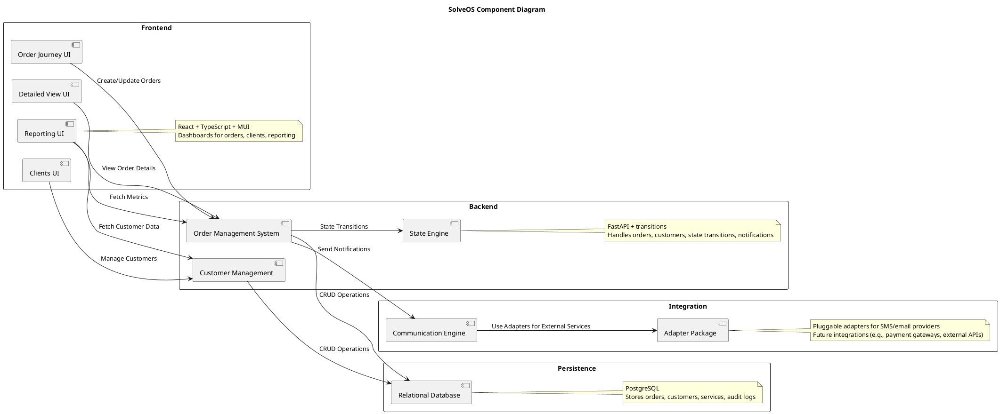

# SolveOS — Business Requirements Document

Version: 1.0
Author: Project Owner  
Last Updated: 2025-10-18

## 1. Project Vision

SolveOS helps small service-oriented businesses manage orders, customers, and daily operations through a single unified interface. It replaces spreadsheets with a simple yet powerful platform for managing service orders by tracking progress, analysing performance, and simplifying workflow. Built-in notifications and reporting dashboards keep both staff and customers informed every step of the way.

## 2. Onboarding Experience

As a user i want to be able to create a new order as soon as a client walks in the door. I have a dashboard that allows me to open a new order window that i can fill in the with the client and item information. The system should allow me to search for existing user or create a new one in case an existing one isn't found. When creating a new client we should store its name, fiscal number, phone number and email. After we start adding items into the order and for each item there's a service associated. Items have a name and get their initial state of received. Services have different categories: Service level is mandatory and has three options Standard, Extra and Premium. There's additional services that can be added like whitening, suede treatment and painting. All items should be cleaned within 10 business days and there's and urgency services that allows items to be completed within 24h, 48h or 5 days. Each of these services have their fixed but configurable price. After all the items have been added and the a client has been associated then the order can be created. As the order is created all the services across the different items should be added up to be displayed as the order total. All orders start in the Received state and should go to an order dashboard where they are showed starting from the oldest one with sorting and filtering options. In the work dashboard it should show all items also with filtering and sorting abilities and allow the worker to view the services associated with each item and start work on them which moves the state from received to in progress. When the first item in an order transitions state the order itself should also transition state to in progress. The worker should be able to trasition items between states and when all the items in the order are ready the order itself moves into the ready state. The same should be true for the delivered state and in the worker should be able to set the full order as delivered as well, saving time on pressing each item individually.

## 3. Business Requirements

### A. Orders

| Code | Requirement |
|------|--------------|
| A01 | The system shall allow creating a new order for a customer. |
| A03 | The system shall allow adding one or more services to an order. |
| A04 | The system shall calculate the total order price automatically based on selected services and applied modifiers. |
| A05 | The system shall show and allow updating the status of each service (e.g., Received, In Progress, Ready, Delivered). |
| A06 | The system shall allow marking a service as paid. |
| A07 | The system shall automatically timestamp key status changes (start, ready, delivered). |
| A08 | The system shall provide an overview of all active orders with filters and sorting by customer, date, or status. |
| A09 | The system shall clearly display any upcoming or overdue services. |
| A10 | The system shall allow order details to be viewed when pressing on and order. |

### B. Services & Modifiers

| Code | Requirement |
|------|--------------|
| B01 | The system shall allow defining a list of base services with standard prices and durations. |
| B02 | The system shall support configurable modifiers (e.g., urgency, premium handling) that adjust price and/or duration. |
| B03 | The system shall allow setting default modifier values at platform or service level, with manual overrides when needed. |

### C. Customers

| Code | Requirement |
|------|--------------|
| C01 | The system shall store basic customer information (name, nif, phone, email, notes). |
| C02 | The system shall display the order history per customer. |
| C03 | The system shall allow searching for customers by name, nif, phone and email. |
| C04 | The system shall allow soft deletion with annonamization of customer records. |

### D. Reporting & Metrics

| Code | Requirement |
|------|--------------|
| D01 | The system shall display daily and weekly totals of services received, in progress, and completed. |
| D02 | The system shall show average completion time per service and modifier type. |
| D03 | The system shall show revenue summaries per day, week, and service type. |
| D04 | The system shall estimate daily throughput capacity based on recent averages. |
| D05 | The system shall highlight overdue or delayed services. |
| D06 | The system shall provide visual dashboards with charts for performance metrics. |
| D07 | The system shall display the percentage of orders using specific modifiers (e.g., urgency or premium). |
| D08 | The system shall show average revenue per order. |
| D09 | The system shall calculate and display the repeat customer rate. |
| D10 | The system shall show total time from order creation to delivery for completed orders. |

### E. Notifications & Communication

| Code | Requirement |
|------|--------------|
| E01 | The system shall notify the customer when their service is ready (e.g., SMS, email). |
| E02 | The system shall optionally alert staff when upcoming and overdue services require attention. |

### F. Interface & Usability

| Code | Requirement |
|------|--------------|
| F01 | The system shall allow fast order creation with minimal required fields. |
| F02 | The system shall provide quick-access buttons for changing service status. |
| F03 | The system shall present clear colour indicators for service progress. |
| F04 | The system shall work smoothly on desktop and tablet screens. |
| F05 | The system shall provide a summary dashboard for showing total orders, revenue, and efficiency. |

## 4. Architecture Diagram

## 5. Tech Stack

Recommended (selected) tech stack for SolveOS

- Frontend: React with TypeScript and Material UI (MUI)
  - Rationale: strong typing, shared DTOs/types with backend, mature component library with accessibility and theming support.
- Backend: Python with FastAPI and transitions
  - Rationale: async-first performance, Pydantic for data validation, automatic OpenAPI generation, and strong ecosystem for data/analytics.
- Database: PostgreSQL
  - Use: relational persistence for orders, items, customers, and audit logs. Use Alembic for migrations and implement soft-delete patterns.
