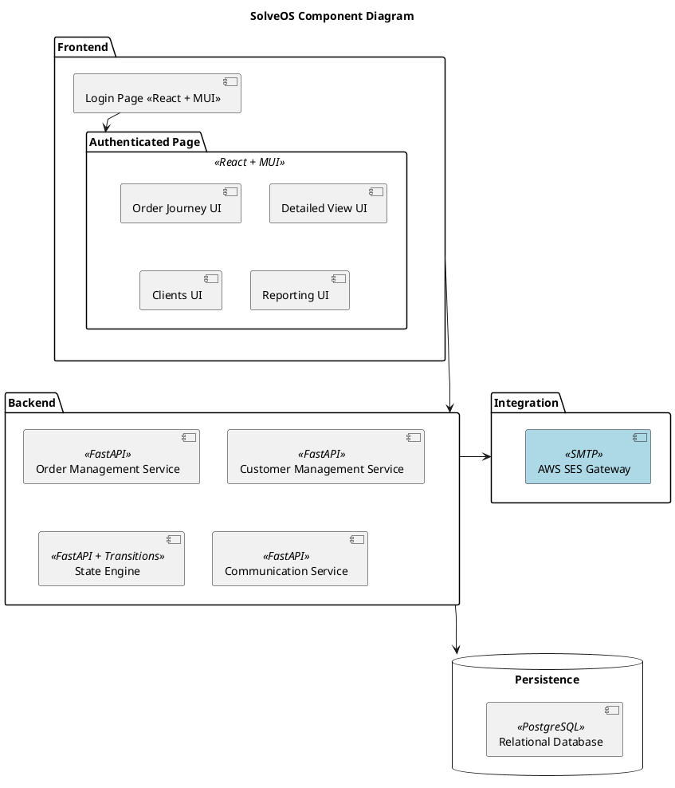

# SolveOS — Business Requirements Document

Version: 1.0
Author: Project Owner  
Last Updated: 2025-10-18

## 1. Project Vision

SolveOS helps small service-oriented businesses manage orders, customers, and daily operations through a single unified interface. It replaces spreadsheets with a simple yet powerful platform for managing service orders by tracking progress, analysing performance, and simplifying workflow. Built-in notifications and reporting dashboards keep both staff and customers informed every step of the way.

## 2. Business Requirements

### A. Orders

| Code | Requirement |
|------|--------------|
| A01 | The system shall allow creating a new order for a customer. |
| A03 | The system shall allow adding one or more services to an order. |
| A04 | The system shall calculate the total order price automatically based on selected services and applied modifiers. |
| A05 | The system shall show and allow updating the status of each service (e.g., Received, In Progress, Ready, Delivered). |
| A06 | The system shall allow marking a service as paid. |
| A07 | The system shall automatically timestamp key status changes (start, ready, delivered). |
| A08 | The system shall provide an overview of all active orders with filters and sorting by customer, date, or status. |
| A09 | The system shall clearly display any upcoming or overdue services. |
| A10 | The system shall allow order details to be viewed when pressing on and order. |

### B. Services & Modifiers

| Code | Requirement |
|------|--------------|
| B01 | The system shall allow defining a list of base services with standard prices and durations. |
| B02 | The system shall support configurable modifiers (e.g., urgency, premium handling) that adjust price and/or duration. |
| B03 | The system shall allow setting default modifier values at platform or service level, with manual overrides when needed. |

### C. Customers

| Code | Requirement |
|------|--------------|
| C01 | The system shall store basic customer information (name, nif, phone, email, notes). |
| C02 | The system shall display the order history per customer. |
| C03 | The system shall allow searching for customers by name, nif, phone and email. |
| C04 | The system shall allow soft deletion with annonamization of customer records. |

### D. Reporting & Metrics

| Code | Requirement |
|------|--------------|
| D01 | The system shall display daily and weekly totals of services received, in progress, and completed. |
| D02 | The system shall show average completion time per service and modifier type. |
| D03 | The system shall show revenue summaries per day, week, and service type. |
| D04 | The system shall estimate daily throughput capacity based on recent averages. |
| D05 | The system shall highlight overdue or delayed services. |
| D06 | The system shall provide visual dashboards with charts for performance metrics. |
| D07 | The system shall display the percentage of orders using specific modifiers (e.g., urgency or premium). |
| D08 | The system shall show average revenue per order. |
| D09 | The system shall calculate and display the repeat customer rate. |
| D10 | The system shall show total time from order creation to delivery for completed orders. |

### E. Notifications & Communication

| Code | Requirement |
|------|--------------|
| E01 | The system shall notify the customer when their service is ready (e.g., SMS, email). |
| E02 | The system shall optionally alert staff when upcoming and overdue services require attention. |

### F. Interface & Usability

| Code | Requirement |
|------|--------------|
| F01 | The system shall allow fast order creation with minimal required fields. |
| F02 | The system shall provide quick-access buttons for changing service status. |
| F03 | The system shall present clear colour indicators for service progress. |
| F04 | The system shall work smoothly on desktop and tablet screens. |
| F05 | The system shall provide a summary dashboard for showing total orders, revenue, and efficiency. |

## 2. Example Journey

When a customer walks in, staff can quickly create a new order from the dashboard. The new-order form lets them search for an existing customer or add a new one (name, fiscal number/NIF, phone and email). An order contains one or more items; each item has a name and an initial state of "Received." Services are attached to items and include:

- Service level (required): Standard, Extra, Premium.
- Optional add-ons: whitening, suede treatment, painting.
- Urgency modifiers: 24 hours, 48 hours, 5 days.
- Default turnaround: 10 business days (unless an urgency modifier is applied).

Each service and modifier has a configurable fixed price. When an order is created, the system calculates the order total by summing the prices of all services across every item.

Orders start in the Received state and appear in the Orders dashboard sorted oldest-first, with filtering and search by customer, date, or status. The Work dashboard lists individual items (also with filtering and sorting) and shows each item's services.

A worker can change an item’s status (Received → In Progress → Ready → Delivered). When the first item in an order moves to In Progress, the order state becomes In Progress. When all items are Ready, the order becomes Ready; when all items are Delivered, the order becomes Delivered. To save time, a worker may also mark the entire order as Delivered in a single action.

State changes should be timestamped and visible in the order details (see requirement A07). The workflow should make it easy to track progress at both the order and item level while keeping totals and customer information accurate and up to date.

## 3. Architecture Diagram

## 5. Tech Stack

- **Frontend**: React with TypeScript and Material UI (MUI)
  - Strong typing, shared types with backend, accessible components.

- **Backend**: Python with FastAPI and transitions
  - Async performance, auto API docs, state machine for workflows.

- **Database**: PostgreSQL
  - Relational storage for orders, customers, audit logs. Alembic migrations, soft deletes.
